# OpenSSF Community

🚧 This Repo Is Under Construction 🚧

Welcome to the OpenSSF Community! For any questions, concerns, reports, etc., please email operations@openssf.org.

This is the starting point for the community to learn how to contribute. 

We keep a [living spreadsheet of all the working groups, projects, and special interest groups](https://docs.google.com/spreadsheets/d/140czMjqhe9YxLBTx4rWkjHxWEWqD_tVQ1s8l9Q2PE2g/edit#gid=1040608229) that contains meeting links, notes and most recent TAC updates. 

## Overall structure

```mermaid
%%{init:{'flowchart':{'nodeSpacing': 0, 'rankSpacing': 0}}}%%
%%{init:{'subgraph':{'nodeSpacing': -10, 'rankSpacing': -40}}}%%
%%{init:{'note':{'nodeSpacing': -10, 'rankSpacing': -40}}}%%
%%%%{init: {'flowchart' : {'curve' : 'linear'}}}%%%%

graph TB

bp("<b>Best Practices WG</b> \nIdentification, awareness, and education \nof security best practices")
bp --- bpA
style note fill:#3d1973,stroke:#FFF,stroke-width:0px
classDef type stroke-width:0px ,primaryTextColor:#fff, color:#FFF, fill:transparent

subgraph bpA[ ]
    direction LR
    style bpA fill:#281151,stroke:#333,stroke-width:4px
    bp1(Secure Software Development Fundamentals Courses):::type
    bp2(<font color=orange>Security Knowledge Framework 'SKF'):::type
    bp3(<font color=orange>OpenSSF Best Practices Badge):::type
    bp4(<font color=orange><b><i>OpenSSF Scorecard</b></i>):::type
    bp5(<font color=orange>Common Requirements Enumeration 'CRE'):::type
    bp6(Concise & Best Practices Guides):::type
    bp7(Education):::type
    bp8(Memory Safety):::type
    bp9(The Security Toolbelt):::type
end
    click bp "https://github.com/ossf/wg-best-practices-os-developers" "Best Practices"
    click bp1 "https://openssf.org/training/courses/" "Secure Software Development Fundamentals"
    click bp2 "https://www.securityknowledgeframework.org/#:~:text=part%20of%20the-,OpenSSF,-Working%20group%3A%20Best" "Security Knowledge Framework 'SKF'"
    click bp3 "https://bestpractices.coreinfrastructure.org" "OpenSSF Best Practices Badge"
    click bp4 "https://github.com/ossf/scorecard" "OpenSSF Scorecard"
    click bp5 "https://github.com/OWASP/OpenCRE" "Common Requirements Enumeration"
    click bp6 "https://openssf.org/resources/guides/" "Concise & Best Practices Guides"
    click bp7 "https://github.com/ossf/education" "Education"
    click bp8 "https://github.com/ossf/Memory-Safety" "Memory Safety"
    click bp9 "https://github.com/ossf/toolbelt" "Security Toolbelt"



st("<b><i>Security Toolings WG</b></i> \n State of the art security tools")
st --- stA

subgraph stA[ ]
    style stA fill:#491b86,stroke:#FFF,stroke-width:4px
    direction LR

    st1(<font color=white><b><i>SBOM Everywhere</b></i>):::type
    st2(<font color=white><b><i>OSS Fuzzing</b></i>):::type
    st3(<font color=orange><b><i>SBOMit</b></i>):::type

end
    click st "https://github.com/ossf/wg-security-tooling" "Security Tooling"
    click st1 "https://drive.google.com/drive/folders/154MCLeIOQEgPpTUL7yzplOiipBVJ5KZJ" "SBOM Everywhere"
    click st2 "https://docs.google.com/document/d/1TmhqYpB1Ly-5o-F31RVHxgpunW6qeDTVopBCtCmKhs0/edit" "OSS Fuzzing"
    click st3 "https://github.com/sbomit" "SBOMit"

sc("<b><i>Supply Chain Integrity WG</b></i> \nEnsuring the provenance of \nopen source code")
sc --- scA

subgraph scA[ ]
    style scA fill:#491b86,stroke:#FFF,stroke-width:4px
    direction LR
    sc1(<b><i><font color=orange>Supply-chain Levels for Software Artifacts 'SLSA' SIG</b></i>):::type
    sc2(<b><i><font color=white>Secure Supply Chain Consumpt Framework 'S2C2F'</b></i>):::type
    sc3(<b><i><font color=orange>gittuf</b></i>):::type
    sc4(<b><i><font color=orange>GUAC</b></i>):::type
end
    click sc "https://github.com/ossf/wg-supply-chain-integrity" "Supply Chain Integrity"
    click sc1 "https://slsa.dev/" "SLSA"
    click sc2 "https://github.com/ossf/s2c2f" "S2C2F"
    click sc3 "https://github.com/gittuf/gittuf" "gittuf"
    click sc4 "https://github.com/guacsec/guac" "GUAC"
subgraph note
    direction LR
    Y(<i><b>Initiatives in italic are seeking members and actively meeting</i></b>):::type
    Z(<i><b><font color=orange>Projects are Orange</i></b>):::type
    X(<i><b><font color=white>SIGs are White</i></b>):::type
end
 
vd("<b><i>Vulnerability Disclosures WG</b></i> \n Efficient vulnerability reporting \nand remediation")
vd --- vdA

subgraph vdA[ ]
    style vdA fill:#491b86,stroke:#FFF,stroke-width:4px
    direction LR
    vd1(<font color=white>CVD Guides):::type
    vd2(<font color=white>OSS-SIRT SIG):::type
    vd3(<font color=orange>Open Source Vuln Schema 'OSV'):::type
    vd4(<b><i><font color=white>OpenVEX SIG</b></i>):::type
    vd5(<font color=white>Vuln Autofix SIG):::type

end
    click vd "https://github.com/ossf/wg-supply-chain-integrity" "Supply Chain Integrity"
    click vd1 "https://github.com/ossf/oss-vulnerability-guide" "CVD"
    click vd2 "https://github.com/ossf/SIRT" "SIRT"
    click vd3 "https://github.com/ossf/osv-schema" "OSV"
    click vd4 "https://github.com/ossf/OpenVEX" "OpenVEX"

ss("<b><i>Securing Software Repositories</b></i> \n Collaboration between repository operators")
ss --- ssA

subgraph ssA[ ]
    style ssA fill:#491b86,stroke:#FFF,stroke-width:4px
    direction LR
    ss1(<b><i><font color=orange>RSTUF</b></i>):::type

end
    click ss "https://github.com/ossf/wg-securing-software-repos" "Securing Software Repositories"
    click ss1 "https://github.com/repository-service-tuf" "RSTUF"

eu("<b><i>End Users</b></i> \n Voice of public & private sector orgs \nthat primarily consume open source")
eu --- euA

subgraph euA[ ]
    style euA fill:#491b86,stroke:#FFF,stroke-width:4px
    direction LR
    eu1(<b><i><font color=white>Threat Modeling</b></i>):::type

end
    click eu "https://github.com/ossf/wg-securing-software-repos" "Securing Software Repositories"
    click eu1 "https://docs.google.com/document/d/1abI65H4pF5y8YtA2_TuDBAaI47v9mTfpr5mwVvccX_I/edit" "Threat Modeling"

mm("<b><i>Metrics & Metadata WG </b></i> \n Security metrics/reviews for \nopen source projects")
mm --- mmA

subgraph mmA[ ]
    style mmA fill:#491b86,stroke:#FFF,stroke-width:4px
    direction LR
    mm1(<font color=orange>Security Insights):::type
    mm2(<font color=orange>Security-Metrics: Risk Dashboard):::type
    mm3(<font color=orange>Security Reviews):::type
    mm5(<font color=orange>ecurity Insights Spec ):::type

end
    click mm "https://github.com/ossf/wg-identifying-security-threats" "Metrics & Metadata"
    click mm1 "https://github.com/ossf/security-insights-spec" "Security Insights"
    click mm2 "https://github.com/ossf/Project-Security-Metrics" "Security-Metrics: Risk Dashboard"
    click mm3 "https://github.com/ossf/security-reviews" "Security Reviews"
    click mm4 "https://github.com/ossf/security-insights-spec" "ecurity Insights Spec"


scp("<b><i>Securing Critical Projects WG</b></i> \n Identification of critical \nopen source projects")
scp --- scpA

subgraph scpA[ ]
    style scpA fill:#491b86,stroke:#FFF,stroke-width:4px
    direction LR
    scp1(<font color=white>List of Critical OS Prj, components, & Frameworks):::type
    scp2(<font color=orange>Criticality Score):::type
    scp3(<font color=white>Harvard study):::type
    scp5(<font color=white>Package Analysis/Feeds):::type

end
    click scp "https://github.com/ossf/wg-securing-critical-projects" "Securing Critical Projects"
    click scp1 "https://docs.google.com/spreadsheets/d/1ONZ4qeMq8xmeCHX03lIgIYE4MEXVfVL6oj05lbuXTDM/edit" "List of Critical OS Prj, components, & Frameworks"
    click scp2 "https://github.com/ossf/criticality_score" "criticality_score"
    click scp3 "https://www.coreinfrastructure.org/programs/census-program-ii/" "Harvard study"
    click scp4 "https://github.com/ossf/package-analysis" "Package Analysis"

subgraph note
    direction LR
    Y(<i><b>Initiatives in italic are seeking members and actively meeting</i></b>):::type
    Z(<i><b><font color=orange>Projects are Orange</i></b>):::type
    X(<i><b><font color=white>SIGs are White</i></b>):::type
end



wg(" ")
wg ~~~~~ wgA

subgraph wgA[ ]
    style wgA fill:#ececff,stroke:#FFF,stroke-width:4px
    direction LR
    wg1(<i><b><<font color=black>AI/ML Security WG</i></b>):::type
    wg2(<i><b><<font color=black>DevRel Community</i></b>):::type
    wg3(<i><b><<font color=black>Diversity, Equity, & Inclusion WG</i></b>):::type

end
    click wg1 "https://github.com/ossf/ai-ml-security" "AI/ML Security"
    click wg2 "https://github.com/ossf/DevRel-community" "DevRel"
    click wg3 "https://openssf.slack.com/archives/C068TF7AH0U" "Diversity, Equity, & Inclusion"

vdA ~~~~ ss 
bpA ~~~~ eu
mmA ~~~~ st
scA ~~~~ scp


mmA ~~~~~~ note
bpA ~~~ wg
```

Here is the structure of the OpenSSF Work Groups. Click on each Work Group, Special Interest Group, or Project to learn more about that Technical initiative. Note that those in _italic_ are seeking new members right now!

## OpenSSF Projects sorted by Work Group
### Securing Critical Projects Work Group
#### Allstar 

Allstar is a GitHub App that continuously monitors GitHub organizations or repositories for adherence to security best practices. If Allstar detects a security policy violation, it creates an issue to alert the repository or organization owner. For some security policies, Allstar can also automatically change the project setting that caused the violation, reverting it to the expected state.

Allstar’s goal is to give you finely tuned control over the files and settings that affect the security of your projects. You can choose which security policies to monitor at both the organization and repository level, and how to handle policy violations. You can also develop or contribute new policies.

Currently, Allstar meets as part of the Scorecard meetings

 

#### Criticality Score

A project's criticality score defines the influence and importance of a project. It is a number between 0 (least-critical) and 1 (most-critical). It is based on the following algorithm by Rob Pike:

We have the Goals
- Generate a criticality score for every open source project.
- Create a list of critical projects that the open source community depends on.
- Use this data to proactively improve the security posture of these critical projects.

Currently, Criticality Score meets as part of the Securing Critical Projects Work Group. Join us every other Thursday.

 

#### Package Analysis / Feeds

The Package Analysis project analyses the capabilities of packages available on open source repositories. The project looks for behaviors that indicate malicious software: 

- What files do they access? 
- What addresses do they connect to? 
- What commands do they run? 

The project also tracks changes in how packages behave over time, to identify when previously safe software begins acting suspiciously. 

This effort is meant to improve the security of open source software by detecting malicious behavior, informing consumers selecting packages, and providing researchers with data about the ecosystem. 

This code is designed to work with the
[Package Feeds](https://github.com/ossf/package-feeds) project,
and originally started there.

If you want to get involved or have ideas you'd like to chat about, we discuss this project in the OSSF Securing Critical Projects Working Group meetings.

 

### Best Practices Work Group
#### Best Practices Badge

We help identify the best practices for Free/Libre and Open Source Software (FLOSS) and implement a badging system for those best practices. The "BadgeApp" badging system is a simple web application that lets projects self-certify that they meet the criteria and show a badge. The real goal of this project is to encourage projects to apply best practices, and to help users determine which FLOSS projects do so. We believe that FLOSS projects that implement best practices are more likely to produce better software, including more secure software.

See the [OpenSSF Best Practices badge website]([url](https://www.bestpractices.dev/en)) if you want to try to get a badge.

Currently, we are not meeting but join us on the slack channel [#wg_best_practices_ossdev](https://openssf.slack.com/archives/C01AHCRP8BT) to participate in the conversation!

 

#### OpenSSF Scorecard

**HELP WANTED**

We created OpenSSF Scorecard to help open source maintainers improve their security best practices and to help open source consumers judge whether their dependencies are safe.

OpenSSF Scorecard is an automated tool that assesses a number of essential heuristics ("checks") associated with software security and assigns each check a score of 0-10. You can use these scores to understand specific areas to improve in order to strengthen the security posture of your project. You can also assess the risks that dependencies introduce and make informed decisions about accepting these risks, evaluating alternative solutions, or working with the maintainers to make improvements.

Currently, we are meeting at many convenient times; Check the [OpenSSF Google Calander](https://calendar.google.com/calendar/u/0?cid=czYzdm9lZmhwNWk5cGZsdGI1cTY3bmdwZXNAZ3JvdXAuY2FsZW5kYXIuZ29vZ2xlLmNvbQ) for a time that fits your needs. 

 

### Security Tooling Work Group
#### Fuzz Introspector	
Fuzz introspector is a tool to help fuzzer developers to get an understanding of their fuzzer’s performance and identify any potential blockers. Fuzz introspector aggregates the fuzzers’ functional data like coverage, hit frequency, entry points, etc to give the developer a birds eye view of their fuzzer. This helps with identifying fuzz bottlenecks and blockers and eventually helps in developing better fuzzers.

Fuzz-introspector aims to improve fuzzing experience of a project by guiding on whether you should:
- introduce new fuzzers to a fuzz harness
- modify existing fuzzers to improve the quality of your harness.
  
We meet monthly on the first Tuesday, join in the conversation

 

#### SBOMit

We created OpenSSF Scorecard to help open source maintainers improve their security best practices and to help open source consumers judge whether their dependencies are safe.

OpenSSF Scorecard is an automated tool that assesses a number of essential heuristics ("checks") associated with software security and assigns each check a score of 0-10. You can use these scores to understand specific areas to improve in order to strengthen the security posture of your project. You can also assess the risks that dependencies introduce and make informed decisions about accepting these risks, evaluating alternative solutions, or working with the maintainers to make improvements.

Currently, we every other Wednesday; Check the [OpenSSF Google Calander](https://calendar.google.com/calendar/u/0?cid=czYzdm9lZmhwNWk5cGZsdGI1cTY3bmdwZXNAZ3JvdXAuY2FsZW5kYXIuZ29vZ2xlLmNvbQ) for a time that fits your needs. 
Or join us on the slack channel [#sbomit](https://openssf.slack.com/archives/C04U3BHL0AE) to join the conversation.

 

### Supply Chain Integrity Work Group
#### GUAC

Software supply chain attacks are on the rise and it’s hard to know what your software is at risk for and how to protect it. Many tools are available to help you generate Software Bills of Materials (SBOMs), signed attestations, and vulnerability reports, but they stop there, leaving you to figure out how they all fit together.

[GUAC (Graph for Understanding Artifact Composition)](https://guac.sh/) aims to fill in the gaps by ingesting software metadata, like SBOMs, and mapping out relationships between software. When you know how one piece of software affects another, you’ll be able to fully understand your software security position and act as needed.

Currently, we have office hours and community meetings; Check the [OpenSSF Google Calander](https://calendar.google.com/calendar/u/0?cid=czYzdm9lZmhwNWk5cGZsdGI1cTY3bmdwZXNAZ3JvdXAuY2FsZW5kYXIuZ29vZ2xlLmNvbQ) for a time that fits your needs. 

Or join us on the slack channel [#guac](https://openssf.slack.com/archives/C03U677QD46) to join the conversation.

 

#### gittuf

[gittuf](https://gittuf.dev/) provides a security layer for Git using some concepts introduced by [The Update Framework (TUF)](https://theupdateframework.io/). Among other features, gittuf handles key management for all developers on the repository, allows you to set permissions for repository branches, tags, files, etc., lets you use new cryptographic algorithms (SHA256, etc.), protects against other attacks Git is vulnerable to, and more — all while being backwards compatible with GitHub, GitLab, etc.

We meet on the first Friday of every month, or join us on the Slack channel [#gittuf](https://openssf.slack.com/archives/C05QVUN4WUW) to talk.

 

#### SLSA Tooling	

**HELP WANTED**

Supply-chain Levels for Software Artifacts, or SLSA ("salsa").

It’s a security framework, a checklist of standards and controls to prevent tampering, improve integrity, and secure packages and infrastructure. It’s how you get from "safe enough" to being as resilient as possible, at any link in the chain.

We would love to have you join our slack channel [#slsa-specification](https://openssf.slack.com/archives/C03NUSAPKC6)
Also, every week on Monday, we meet on Zoom; join us next week! Check the [OpenSSF Google Calander](https://calendar.google.com/calendar/u/0?cid=czYzdm9lZmhwNWk5cGZsdGI1cTY3bmdwZXNAZ3JvdXAuY2FsZW5kYXIuZ29vZ2xlLmNvbQ) for the invite.

 

### Vulnerability Disclosures Work Group
#### OSV Schema	

This is the repository for the Open Source Vulnerability schema (OSV Schema), which is currently exported by:
- [AlmaLinux](https://github.com/AlmaLinux/osv-database)
- [Bitnami Vulnerability Database](https://github.com/bitnami/vulndb)
- [Curl](https://curl.se/docs/vuln.json)
- [GitHub Security Advisories](https://github.com/github/advisory-database)
- [Global Security Database](https://github.com/cloudsecurityalliance/gsd-database)
- [Go Vulnerability Database](https://github.com/golang/vulndb)
- [Haskell Security Advisories](https://github.com/haskell/security-advisories)
- [LoopBack Advisory Database](https://github.com/loopbackio/security/tree/main/advisories)
- [OSS-Fuzz](https://github.com/google/oss-fuzz-vulns)
- [OSV.dev maintained converters](https://github.com/google/osv.dev#current-data-sources) (Debian, Alpine, NVD)
- [PyPI Advisory Database](https://github.com/pypa/advisory-database)
- [Python Software Foundation Database](https://github.com/psf/advisory-database)
- [RConsortium Advisory Database](https://github.com/RConsortium/r-advisory-database)
- [Rocky Linux](https://distro-tools.rocky.page/apollo/openapi/#osv)
- [Rust Advisory Database](https://github.com/RustSec/advisory-db)
- [VMWare Photon OS](https://github.com/vmware/photon/wiki/Security-Advisories) (unofficial)

Currently, we are not meeting but join us on the slack channel [#osv_schema](https://openssf.slack.com/archives/C03K6SZBH2S) to participate in the conversation!

 

### Securing Software Repositories Work Group
#### Repository Service for TUF	

[Repository Service for TUF (RSTUF)](https://github.com/repository-service-tuf/repository-service-tuf) is a collection of components that provide services for securing content downloads from tampering between the repository and the client (for example, by an on-path attacker).

RSTUF security properties are achieved by implementing The Update Framework (TUF) as a service.

Repository Service for TUF is platform, artifact, language, and process-flow agnostic.

RSTUF simplifies the adoption of TUF by removing the need to design a repository integration -- RSTUF encapsulates that design.

Repository Service for TUF (RSTUF) is designed to be integrated with existing content delivery solutions -- at the edge or in public/private clouds -- alongside current artifact production systems, such as build systems, including; Jenkins, GitHub Actions, GitLab, CircleCI, etc. RSTUF protects downloading, installing, and updating content from arbitrary content repositories, such as a web server, JFrog Artifactory, GitHub packages, etc.

Our community meetings are Monthly on the first Wednesday. 
Join us on the slack channel [#repository-service-tuf](https://openssf.slack.com/archives/C052QF5CZFH) to participate in the conversation!

 

### Identifying Security Threats Work Group (New Name: Metrics & Metadata)

The following projects are discussed at the work group level every other Wednesday. To join the meeting see the[OpenSSF Community Calendar](https://calendar.google.com/calendar?cid=czYzdm9lZmhwNWk5cGZsdGI1cTY3bmdwZXNAZ3JvdXAuY2FsZW5kYXIuZ29vZ2xlLmNvbQ).

#### Security Insights Spec

This specification provides a mechanism for projects to report information about their security in a machine-processable way. It is formatted as a YAML file to make it easy to read and edit by humans.

Values that are included within the specification may be required or optional. Optional values are recommendations from the Open Source Security Foundation's _Identifying Security Threats Working Group_, but may not be prudent for all use cases.

Example implementations can be found on the specification's [GitHub repository](https://github.com/ossf/security-insights-spec).

A collection of unofficial supplemental tooling can be found in the ["SI Tooling" GitHub Repository](https://github.com/ossf/si-tooling).

We are not seeking new members but improvement, suggestions and clarification requests can be logged as [GitHub Issues](https://github.com/ossf/security-insights-spec/issues/new), raised as discussion on [Slack channel #security_insights](https://openssf.slack.com/archives/C04BB493NET). 

To discuss live join the work group meeting. 

#### Security Metrics	

The purpose of this project is to collect, organize, and provide interesting security metrics for open source projects to stakeholders, including users.

This project is in early development and we welcome community support. 

To discuss live join the work group meeting. 

### Top Level or Affiliated 
#### Sigstore

Learn more at [https://sigstore.dev/](https://sigstore.dev/)

We meet every 2 weeks on Tuesday
 
 

#### Core Toolchain Infrastructure	
**Coming soon**

 

#### Alpha Omega	

Alpha-Omega is an associated project of the OpenSSF, established in February 2022, funded by Microsoft, Google, and Amazon, and with a mission to protect society by catalyzing sustainable security improvements to the most critical open source software projects and ecosystems. The project aims to build a world where critical open source projects are secure and where security vulnerabilities are found and fixed quickly.

We meet on the first Wednesday of each month or join us on the slack channel [#alpha_omega](https://openssf.slack.com/archives/C02LUUWQZNK) to participate in the conversation!
 

## Work Group Information

### [tac](https://github.com/ossf/tac)

 The OpenSSF Technical Advisory Council is responsible for oversight of the various Technical Initiatives (TI) of the OpenSSF.

 [Join us via this Zoom Link](https://zoom-lfx.platform.linuxfoundation.org/meeting/94234355704?password=939d8506-7e58-4072-89e3-6b59259ee9db)

 We meet every other Tuesday 11:00a ET

[Here are our meeting notes](https://docs.google.com/document/d/1JY8FREBPCUUFpuv7-4B9EjeS2MLDpel0dbG5DFWrTns/edit?usp=drive_link)

[Join us on Slack channel #tac](https://openssf.slack.com/archives/C01AAV2TTEG)

 **Our Group Lead(s):**
- [Christopher CRob Robinson](https://github.com/SecurityCRob)

 

### [wg-best-practices-os-developers](https://github.com/ossf/wg-best-practices-os-developers)

 Want to help drive open source security education or help develop best practices? We have a lot of projects and groups that are working towards these goals.

 [Join us via this Zoom Link](https://zoom-lfx.platform.linuxfoundation.org/meeting/97123533582?password=51bc1484-f12d-4382-b768-6d8f3c9b08c2)

 We meet None

[Here are our meeting notes](https://docs.google.com/document/d/1JY8FREBPCUUFpuv7-4B9EjeS2MLDpel0dbG5DFWrTns/edit?usp=drive_link)

[Join us on Slack channel #wg_best_practices_ossdev](https://openssf.slack.com/archives/C01AHCRP8BT)

 **Our Group Lead(s):**
- [Christopher CRob Robinson](https://github.com/SecurityCRob)

 

### [ai-ml-security](https://github.com/ossf/ai-ml-security)

 We formed in September 2023 after the growing problem of AI/ML Security in open source. Join is to discuss the possible security impacts of AI / ML technologies on open source software, maintainers, communities, and their adopters, along with how OSS projects could safely or effectively leverage LLMs to improve their security posture.

 [Join us via this Zoom Link](https://zoom-lfx.platform.linuxfoundation.org/meeting/97349085860?password=3d2b70af-6d20-4b45-ac5b-de4e99e964ae)

 We meet every other Monday 1:00p ET

[Here are our meeting notes](https://docs.google.com/document/d/1YNP-XJ9jpTjM6ekKOBgHH8-avAws2DVKeCpn858siiQ/edit#heading=h.l453rgplh0xw)

[Join us on Slack channel #wg_ai_ml_security](https://openssf.slack.com/archives/C0587E513KR)

 **Our Group Lead(s):**
- [Mihai Maruseac](https://github.com/mihaimaruseac)

 

### [wg-vulnerability-disclosures](https://github.com/ossf/wg-vulnerability-disclosures)

 We are improving the overall security of the OSS ecosystem by helping advance vulnerability reporting and communication.

 [Join us via this Zoom Link](https://zoom-lfx.platform.linuxfoundation.org/meeting/93701721327?password=a2e18922-298a-4d84-ba1f-55af95f0f5cc)

 We meet every other Wednesday 11:00a ET

[Here are our meeting notes](https://docs.google.com/document/d/1AXkapzjZ-SxwcBN7rZeSstkzdapd3sbzfHDxz6A59Ic/edit)

[Join us on Slack channel #wg_vulnerability_disclosures](https://openssf.slack.com/archives/C019Y2A28Q6)

 **Our Group Lead(s):**
- [Christopher CRob Robinson](https://github.com/SecurityCRob)

 

### [wg-dei](https://github.com/ossf/wg-dei)

 We formed in December 2023 to help increase representation and strengthen the overall effectiveness of the cybersecurity workforce.

 [Join us via this Zoom Link](https://zoom-lfx.platform.linuxfoundation.org/meeting/98853031629?password=a356aa22-ab31-4e2e-a8a0-9ecb45af84bd)

 We meet every other Tuesday 11:00a ET

[Here are our meeting notes](https://docs.google.com/document/d/1zGTOJdFVIMnixT3EFQ6_bbQ0iy7f4Z4TxhX9A5VY9TM/edit)

[Join us on Slack channel #wg_dei](https://openssf.slack.com/archives/C068TF7AH0U)

 **Our Group Lead(s):**
- [Jay White](https://github.com/camaleon2016)

 

### [wg-endusers](https://github.com/ossf/wg-endusers)

 We represent the interests of public and private sector organizations that primarily consume open source rather than produce it. Right now, we are focusing on threat modeling. Join us to see how threat modeling works and get your ideas in the current scope.

 [Join us via this Zoom Link](https://zoom-lfx.platform.linuxfoundation.org/meeting/95757110915?password=21683129-f958-4ea8-a36d-1fffaa06f49c)

 We meet every Monday 12:30p ET

[Here are our meeting notes](https://docs.google.com/document/d/1JrKetG5zeDqUn9n7SKI3L0oR-S9k0r4YMHFcqhZ7WNU/edit?usp=sharing)

[Join us on Slack channel #wg_end_users](https://openssf.slack.com/archives/C03488JMKNX)

 **Our Group Lead(s):**
- [Jonathan Meadows](https://github.com/jonmuk)

 

### [wg-identifying-security-threats](https://github.com/ossf/wg-identifying-security-threats)

 Now called Metrics & Metadata! We enable informed confidence in the security of OSS by collecting, curating, and communicating relevant metrics and metadata. Our WG has mostly projects that focus on the code to get this done.

 [Join us via this Zoom Link](https://zoom-lfx.platform.linuxfoundation.org/meeting/99771890101?password=9f10219a-9545-4047-80fb-b5ca75bc850c)

 We meet every other Wednesday 1:00p ET

[Here are our meeting notes](https://docs.google.com/document/d/1XimygAYGbG2aofAiBD9--ZMTALdnbdbVw53R851ZZKY/edit?usp=sharing)

[Join us on Slack channel #wg_identifying_security_threats](https://openssf.slack.com/archives/C01A50B978T)

 **Our Group Lead(s):**
- [Michael Scovetta](https://github.com/scovetta)

 

### [wg-security-tooling](https://github.com/ossf/wg-security-tooling)

 Our mission is to provide the best security tools for open source developers and make them universally accessible. We talk a lot about SBOMs currently.

 [Join us via this Zoom Link](https://zoom-lfx.platform.linuxfoundation.org/meeting/94897563315?password=7f03d8e7-7bc9-454e-95bd-6e1e09cb3b0b)

 We meet every other Friday 11:00a ET

[Here are our meeting notes](https://docs.google.com/document/d/1bFpHEbbEUf2rWiYXQY7cGg1HrmI9TqwaD8U_3Hi9A8I/edit?usp=sharing)

[Join us on Slack channel #wg_security_tooling](https://openssf.slack.com/archives/C019Q1VEA87)

 **Our Group Lead(s):**
- [Ryan Ware](https://github.com/ware)

 

### [wg-securing-software-repos](https://github.com/ossf/wg-securing-software-repos)

 We provide a collaborative environment for aligning on the introduction of new tools and technologies to strengthen and secure software repositories. Our current project is Repository Service for TUF, join to learn more.

 [Join us via this Zoom Link](https://zoom-lfx.platform.linuxfoundation.org/meeting/98058137343?password=28dafc6e-cfcf-440d-bb63-ca73a1739f06)

 We meet every 4 weeks on Wednesday at 6:00p ET and every 4 weeks on Thursday at 9:00pa ET

[Here are our meeting notes](https://docs.google.com/document/d/1HzA4M4toiExUYQAkuLqimy4EuuunHagUQ7rZKJDb1Os/edit?usp=sharing)

[Join us on Slack channel #wg_securing_software_repos](https://openssf.slack.com/archives/C034CBLMQ9G)

 **Our Group Lead(s):**
- [Dustin Ingram](https://github.com/di)

 

### [wg-supply-chain-integrity](https://github.com/ossf/wg-supply-chain-integrity)

 We are helping people understand and make decisions on the provenance of the code they maintain, produce and use. We have great projects like GUAC, SLSA and gittuf that you can work with.

 [Join us via this Zoom Link](https://zoom-lfx.platform.linuxfoundation.org/meeting/96297611656?password=f030337b-dc4d-43d4-ac55-26db510f3d1c)

 We meet every other Wednesday 12:00p ET

[Here are our meeting notes](https://docs.google.com/document/d/1NzmoZFuyPKmmX7P1GXADfNNmHFDkGHXyE0TfQFX2daw/edit?usp=sharing)

[Join us on Slack channel #wg_supply_chain_integrity](https://openssf.slack.com/archives/C01A1MA7A1K)

 **Our Group Lead(s):**
- [Isaac Hepworth](https://github.com/hepwori)
- [Dan Lorenc](https://github.com/dlorenc)

 

### [wg-securing-critical-projects](https://github.com/ossf/wg-securing-critical-projects)

 Wonder how critical OSS projects are selected? Then join us! We have progress reports every other week on each project/SIG so it is easy to jump in and get going.

 [Join us via this Zoom Link](https://zoom-lfx.platform.linuxfoundation.org/meeting/95053207038?password=41a2966d-c96b-42d3-b2ee-635fc1dbaf51)

 We meet every 4 weeks on Thursday 12:00p ET

[Here are our meeting notes](https://docs.google.com/document/d/1j_efLVDXGoKgfHHZbJtpBxd_Gso1ghHBdK3NfEVc15o/edit?usp=sharing)

[Join us on Slack channel #wg_securing_critical_projects](https://openssf.slack.com/archives/C019Y2AR76J)

 **Our Group Lead(s):**
- [Jeff Mendoza](https://github.com/jeffmendoza)
- [Amir Hossin Montazery](https://github.com/amirhmh3)

 

## End of Work Group Information

