# OpenSSF Community

🚧 This Repo Is Under Construction 🚧

Welcome to the OpenSSF Community! For any questions, concerns, reports, etc., please email operations@openssf.org.

This is the starting point for the community to learn how to contribute. 

We keep a [living spreadsheet of all the working groups, projects, and special interest groups](https://docs.google.com/spreadsheets/d/140czMjqhe9YxLBTx4rWkjHxWEWqD_tVQ1s8l9Q2PE2g/edit#gid=1040608229) that contains meeting links, notes and most recent TAC updates. 

## Overall structure

```mermaid
%%{init:{'flowchart':{'nodeSpacing': 0, 'rankSpacing': 0}}}%%
%%{init:{'subgraph':{'nodeSpacing': -10, 'rankSpacing': -40}}}%%
%%{init:{'note':{'nodeSpacing': -10, 'rankSpacing': -40}}}%%
%%%%{init: {'flowchart' : {'curve' : 'linear'}}}%%%%

graph TB

bp("<b>Best Practices WG</b> \nIdentification, awareness, and education \nof security best practices")
bp --- bpA
style note fill:#3d1973,stroke:#FFF,stroke-width:0px
classDef type stroke-width:0px ,primaryTextColor:#fff, color:#FFF, fill:transparent

subgraph bpA[ ]
    direction LR
    style bpA fill:#281151,stroke:#333,stroke-width:4px
    bp1(Secure Software Development Fundamentals Courses):::type
    bp2(<font color=orange>Security Knowledge Framework 'SKF'):::type
    bp3(<font color=orange>OpenSSF Best Practices Badge):::type
    bp4(<font color=orange><b><i>OpenSSF Scorecard</b></i>):::type
    bp5(<font color=orange>Common Requirements Enumeration 'CRE'):::type
    bp6(Concise & Best Practices Guides):::type
    bp7(Education):::type
    bp8(Memory Safety):::type
    bp9(The Security Toolbelt):::type
end
    click bp "https://github.com/ossf/wg-best-practices-os-developers" "Best Practices"
    click bp1 "https://openssf.org/training/courses/" "Secure Software Development Fundamentals"
    click bp2 "https://www.securityknowledgeframework.org/#:~:text=part%20of%20the-,OpenSSF,-Working%20group%3A%20Best" "Security Knowledge Framework 'SKF'"
    click bp3 "https://bestpractices.coreinfrastructure.org" "OpenSSF Best Practices Badge"
    click bp4 "https://github.com/ossf/scorecard" "OpenSSF Scorecard"
    click bp5 "https://github.com/OWASP/OpenCRE" "Common Requirements Enumeration"
    click bp6 "https://openssf.org/resources/guides/" "Concise & Best Practices Guides"
    click bp7 "https://github.com/ossf/education" "Education"
    click bp8 "https://github.com/ossf/Memory-Safety" "Memory Safety"
    click bp9 "https://github.com/ossf/toolbelt" "Security Toolbelt"



st("<b><i>Security Toolings WG</b></i> \n State of the art security tools")
st --- stA

subgraph stA[ ]
    style stA fill:#491b86,stroke:#FFF,stroke-width:4px
    direction LR

    st1(<font color=white><b><i>SBOM Everywhere</b></i>):::type
    st2(<font color=white><b><i>OSS Fuzzing</b></i>):::type
    st3(<font color=orange><b><i>SBOMit</b></i>):::type

end
    click st "https://github.com/ossf/wg-security-tooling" "Security Tooling"
    click st1 "https://drive.google.com/drive/folders/154MCLeIOQEgPpTUL7yzplOiipBVJ5KZJ" "SBOM Everywhere"
    click st2 "https://docs.google.com/document/d/1TmhqYpB1Ly-5o-F31RVHxgpunW6qeDTVopBCtCmKhs0/edit" "OSS Fuzzing"
    click st3 "https://github.com/sbomit" "SBOMit"

sc("<b><i>Supply Chain Integrity WG</b></i> \nEnsuring the provenance of \nopen source code")
sc --- scA

subgraph scA[ ]
    style scA fill:#491b86,stroke:#FFF,stroke-width:4px
    direction LR
    sc1(<b><i><font color=orange>Supply-chain Levels for Software Artifacts 'SLSA' SIG</b></i>):::type
    sc2(<b><i><font color=white>Secure Supply Chain Consumpt Framework 'S2C2F'</b></i>):::type
    sc3(<b><i><font color=orange>gittuf</b></i>):::type
    sc4(<b><i><font color=orange>GUAC</b></i>):::type
end
    click sc "https://github.com/ossf/wg-supply-chain-integrity" "Supply Chain Integrity"
    click sc1 "https://slsa.dev/" "SLSA"
    click sc2 "https://github.com/ossf/s2c2f" "S2C2F"
    click sc3 "https://github.com/gittuf/gittuf" "gittuf"
    click sc4 "https://github.com/guacsec/guac" "GUAC"
subgraph note
    direction LR
    Y(<i><b>Initiatives in italic are seeking members and actively meeting</i></b>):::type
    Z(<i><b><font color=orange>Projects are Orange</i></b>):::type
    X(<i><b><font color=white>SIGs are White</i></b>):::type
end
 
vd("<b><i>Vulnerability Disclosures WG</b></i> \n Efficient vulnerability reporting \nand remediation")
vd --- vdA

subgraph vdA[ ]
    style vdA fill:#491b86,stroke:#FFF,stroke-width:4px
    direction LR
    vd1(<font color=white>CVD Guides):::type
    vd2(<font color=white>OSS-SIRT SIG):::type
    vd3(<font color=orange>Open Source Vuln Schema 'OSV'):::type
    vd4(<b><i><font color=white>OpenVEX SIG</b></i>):::type
    vd5(<font color=white>Vuln Autofix SIG):::type

end
    click vd "https://github.com/ossf/wg-supply-chain-integrity" "Supply Chain Integrity"
    click vd1 "https://github.com/ossf/oss-vulnerability-guide" "CVD"
    click vd2 "https://github.com/ossf/SIRT" "SIRT"
    click vd3 "https://github.com/ossf/osv-schema" "OSV"
    click vd4 "https://github.com/ossf/OpenVEX" "OpenVEX"

ss("<b><i>Securing Software Repositories</b></i> \n Collaboration between repository operators")
ss --- ssA

subgraph ssA[ ]
    style ssA fill:#491b86,stroke:#FFF,stroke-width:4px
    direction LR
    ss1(<b><i><font color=orange>RSTUF</b></i>):::type

end
    click ss "https://github.com/ossf/wg-securing-software-repos" "Securing Software Repositories"
    click ss1 "https://github.com/repository-service-tuf" "RSTUF"

eu("<b><i>End Users</b></i> \n Voice of public & private sector orgs \nthat primarily consume open source")
eu --- euA

subgraph euA[ ]
    style euA fill:#491b86,stroke:#FFF,stroke-width:4px
    direction LR
    eu1(<b><i><font color=white>Threat Modeling</b></i>):::type

end
    click eu "https://github.com/ossf/wg-securing-software-repos" "Securing Software Repositories"
    click eu1 "https://docs.google.com/document/d/1abI65H4pF5y8YtA2_TuDBAaI47v9mTfpr5mwVvccX_I/edit" "Threat Modeling"

mm("<b><i>Metrics & Metadata WG </b></i> \n Security metrics/reviews for \nopen source projects")
mm --- mmA

subgraph mmA[ ]
    style mmA fill:#491b86,stroke:#FFF,stroke-width:4px
    direction LR
    mm1(<font color=orange>Security Insights):::type
    mm2(<font color=orange>Security-Metrics: Risk Dashboard):::type
    mm3(<font color=orange>Security Reviews):::type
    mm5(<font color=orange>ecurity Insights Spec ):::type

end
    click mm "https://github.com/ossf/wg-identifying-security-threats" "Metrics & Metadata"
    click mm1 "https://github.com/ossf/security-insights-spec" "Security Insights"
    click mm2 "https://github.com/ossf/Project-Security-Metrics" "Security-Metrics: Risk Dashboard"
    click mm3 "https://github.com/ossf/security-reviews" "Security Reviews"
    click mm4 "https://github.com/ossf/security-insights-spec" "ecurity Insights Spec"


scp("<b><i>Securing Critical Projects WG</b></i> \n Identification of critical \nopen source projects")
scp --- scpA

subgraph scpA[ ]
    style scpA fill:#491b86,stroke:#FFF,stroke-width:4px
    direction LR
    scp1(<font color=white>List of Critical OS Prj, components, & Frameworks):::type
    scp2(<font color=orange>Criticality Score):::type
    scp3(<font color=white>Harvard study):::type
    scp5(<font color=white>Package Analysis/Feeds):::type

end
    click scp "https://github.com/ossf/wg-securing-critical-projects" "Securing Critical Projects"
    click scp1 "https://docs.google.com/spreadsheets/d/1ONZ4qeMq8xmeCHX03lIgIYE4MEXVfVL6oj05lbuXTDM/edit" "List of Critical OS Prj, components, & Frameworks"
    click scp2 "https://github.com/ossf/criticality_score" "criticality_score"
    click scp3 "https://www.coreinfrastructure.org/programs/census-program-ii/" "Harvard study"
    click scp4 "https://github.com/ossf/package-analysis" "Package Analysis"

subgraph note
    direction LR
    Y(<i><b>Initiatives in italic are seeking members and actively meeting</i></b>):::type
    Z(<i><b><font color=orange>Projects are Orange</i></b>):::type
    X(<i><b><font color=white>SIGs are White</i></b>):::type
end



wg(" ")
wg ~~~~~ wgA

subgraph wgA[ ]
    style wgA fill:#ececff,stroke:#FFF,stroke-width:4px
    direction LR
    wg1(<i><b><<font color=black>AI/ML Security WG</i></b>):::type
    wg2(<i><b><<font color=black>DevRel Community</i></b>):::type
    wg3(<i><b><<font color=black>Diversity, Equity, & Inclusion WG</i></b>):::type

end
    click wg1 "https://github.com/ossf/ai-ml-security" "AI/ML Security"
    click wg2 "https://github.com/ossf/DevRel-community" "DevRel"
    click wg3 "https://openssf.slack.com/archives/C068TF7AH0U" "Diversity, Equity, & Inclusion"

vdA ~~~~ ss 
bpA ~~~~ eu
mmA ~~~~ st
scA ~~~~ scp


mmA ~~~~~~ note
bpA ~~~ wg
```

## Repository Information

### [tac](https://github.com/ossf/tac)
**Original Repository:** [tac](https://github.com/ossf/tac)

 **Description:** This is a top level group.
**Leads:**
- [Christopher "CRob" Robinson](https://github.com/SecurityCRob)

### [wg-best-practices](https://github.com/ossf/wg-best-practices)
**Original Repository:** [wg-best-practices-os-developers](https://github.com/ossf/wg-best-practices-os-developers)

 **Description:** This is a top level group
**Leads:**
- [Christopher "CRob" Robinson](https://github.com/SecurityCRob)

### [wg-vulnerability-disclosures](https://github.com/ossf/wg-vulnerability-disclosures)
**Original Repository:** [wg-vulnerability-disclosures](https://github.com/ossf/wg-vulnerability-disclosures)

 **Description:** This is a top level group.

**Leads:**
- [Christopher "CRob" Robinson](https://github.com/SecurityCRob)

### [wg-endusers](https://github.com/ossf/wg-endusers)
**Original Repository:** [wg-endusers](https://github.com/ossf/wg-endusers)

 **Description:** This is a top level group
**Leads:**
- [Jonathan Meadows](https://github.com/jonmuk)

### [wg-identifying-security-threats](https://github.com/ossf/wg-identifying-security-threats)
**Original Repository:** [wg-identifying-security-threats](https://github.com/ossf/wg-identifying-security-threats)

 **Description:** This is a top level group.

**Leads:**
- [Michael Scovetta](https://github.com/scovetta)

### [wg-security-tooling](https://github.com/ossf/wg-security-tooling)
**Original Repository:** [wg-security-tooling](https://github.com/ossf/wg-security-tooling)

 **Description:** This is a top level group.

**Leads:**
- [Josh Bressers](https://github.com/joshbressers)

### [wg-securing-software-repos](https://github.com/ossf/wg-securing-software-repos)
**Original Repository:** [wg-securing-software-repos](https://github.com/ossf/wg-securing-software-repos)

 **Description:** This is a top level group.

**Leads:**
- [Dustin Ingram](https://github.com/di)

### [wg-supply-chain-integrity](https://github.com/ossf/wg-supply-chain-integrity)
**Original Repository:** [wg-supply-chain-integrity](https://github.com/ossf/wg-supply-chain-integrity)

 **Description:** This is a top level group.

**Leads:**
- [Kim Lewandowski](https://github.com/kimsterv)
- [Dan Lorenc](https://github.com/dlorenc)

### [wg-securing-critical-projects](https://github.com/ossf/wg-securing-critical-projects)
**Original Repository:** [wg-securing-critical-projects](https://github.com/ossf/wg-securing-critical-projects)

 **Description:** This is a top level group.

**Leads:**
- [Jeff Mendoza](https://github.com/jeffmendoza)
- [Amir Hossin Montazery](https://github.com/amirhmh3)

### [sig-secure-sw-dev-fundamentals](https://github.com/ossf/sig-secure-sw-dev-fundamentals)
**Original Repository:** [secure-sw-dev-fundamentals](https://github.com/ossf/secure-sw-dev-fundamentals)

 **Description:** This is under the Best Practices working group. Full name is Secure Software Development Fundamentals courses SIG.

**Leads:**
- [David Wheeler](https://github.com/david-a-wheeler)

### [project-scorecard](https://github.com/ossf/project-scorecard)
**Original Repository:** [scorecard](https://github.com/ossf/scorecard)

 **Description:** This is under the Best Practices working group.

**Leads:**
- [Azeem Shaikh](https://github.com/azeemshaikh38)
- [Laurent Simon](https://github.com/laurentsimon)
- [Naveen Srinivasan](https://github.com/naveensrinivasan)
- [Risto McGehee](https://github.com/chrismcgehee)
- [Stephen Augustus](https://github.com/justaugustus)

### [sig-secure-sw-dev-fundamentals](https://github.com/ossf/sig-secure-sw-dev-fundamentals)
**Original Repository:** [great-mfa-project](https://github.com/ossf/great-mfa-project)

 **Description:** This is under the Best Practices working group.

**Leads:**
- [Christopher "CRob" Robinson](https://github.com/SecurityCRob)

### [sig-education](https://github.com/ossf/sig-education)
**Original Repository:** [education](https://github.com/ossf/education)

 **Description:** This is under the Best Practices working group.

**Leads:**
- [Christopher "CRob" Robinson](https://github.com/SecurityCRob)

### [sig-memory-Safety](https://github.com/ossf/sig-memory-Safety)
**Original Repository:** [Memory-Safety](https://github.com/ossf/Memory-Safety)

 **Description:** This is under the Best Practices working group.
**Leads:**
- [Nell Shamrell-Harrington](https://github.com/nellshamrell)

### [sig-oss-vulnerability-guide](https://github.com/ossf/sig-oss-vulnerability-guide)
**Original Repository:** [oss-vulnerability-guide](https://github.com/ossf/oss-vulnerability-guide)

 **Description:** This is under wg-vulnerability-disclosures
**Leads:**
- [Christopher "CRob" Robinson](https://github.com/SecurityCRob)

### [sig-sirt](https://github.com/ossf/sig-sirt)
**Original Repository:** [SIRT](https://github.com/ossf/SIRT)

 **Description:** This is under wg-vulnerability-disclosures
**Leads:**
- [Christopher "CRob" Robinson](https://github.com/SecurityCRob)

### [project-osv-schema](https://github.com/ossf/project-osv-schema)
**Original Repository:** [osv-schema](https://github.com/ossf/osv-schema)

 **Description:** This is under wg-vulnerability-disclosures
**Leads:**
- [Christopher "CRob" Robinson](https://github.com/SecurityCRob)

### [sig-OpenVEX](https://github.com/ossf/sig-OpenVEX)
**Original Repository:** [OpenVEX](https://github.com/ossf/OpenVEX)

 **Description:** This is under wg-vulnerability-disclosures
**Leads:**
- [Christopher "CRob" Robinson](https://github.com/SecurityCRob)

### [project-security-insights-spec](https://github.com/ossf/project-security-insights-spec)
**Original Repository:** [security-insights-spec](https://github.com/ossf/security-insights-spec)

 **Description:** This is under wg-identifying-security-threats

**Leads:**
- [Christopher "CRob" Robinson](https://github.com/SecurityCRob)

### [project-project-Security-Metrics](https://github.com/ossf/project-project-Security-Metrics)
**Original Repository:** [Project-Security-Metrics](https://github.com/ossf/Project-Security-Metrics)

 **Description:** This is under wg-identifying-security-threats

**Leads:**
- [Michael Scovetta](https://github.com/scovetta)

### [project-security-reviews](https://github.com/ossf/project-security-reviews)
**Original Repository:** [security-reviews](https://github.com/ossf/security-reviews)

 **Description:** This is under wg-identifying-security-threats

**Leads:**
- [Michael Scovetta](https://github.com/scovetta)

### [sig-fuzz-introspector](https://github.com/ossf/sig-fuzz-introspector)
**Original Repository:** [fuzz-introspector](https://github.com/ossf/fuzz-introspector)

 **Description:** This is under wg-security-tooling

**Leads:**
- [Josh Bressers](https://github.com/joshbressers)

### [sig-secure-supply-chain-consumption-framework](https://github.com/ossf/sig-secure-supply-chain-consumption-framework)
**Original Repository:** [s2c2f](https://github.com/ossf/s2c2f)

 **Description:** This is under wg-supply-chain-integrity

**Leads:**
- [Jay White](https://github.com/camaleon2016)
- [Adrian Diglio](https://github.com/adriandiglio)
- [Jasmine Wang](https://github.com/jasminewang0)

### [project-criticality_score](https://github.com/ossf/project-criticality_score)
**Original Repository:** [criticality_score](https://github.com/ossf/criticality_score)

 **Description:** This is under wg-securing-critical-projects

**Leads:**
- [Jeff Mendoza](https://github.com/jeffmendoza)
- [Amir Hossin Montazery](https://github.com/amirhmh3)

### [project-package-feeds](https://github.com/ossf/project-package-feeds)
**Original Repository:** [package-feeds](https://github.com/ossf/package-feeds)

 **Description:** This is under wg-securing-critical-projects

**Leads:**
- [Jeff Mendoza](https://github.com/jeffmendoza)
- [Amir Hossin Montazery](https://github.com/amirhmh3)

### [project-package-analysis](https://github.com/ossf/project-package-analysis)
**Original Repository:** [package-analysis](https://github.com/ossf/package-analysis)

 **Description:** This is under wg-securing-critical-projects

**Leads:**
- [Jeff Mendoza](https://github.com/jeffmendoza)
- [Amir Hossin Montazery](https://github.com/amirhmh3)

### [project-allstar](https://github.com/ossf/project-allstar)
**Original Repository:** [allstar](https://github.com/ossf/allstar)

 **Description:** This is under wg-securing-critical-projects

**Leads:**
- [Jeff Mendoza](https://github.com/jeffmendoza)
- [Amir Hossin Montazery](https://github.com/amirhmh3)

### [sig-dei](https://github.com/ossf/sig-dei)
**Original Repository:** [DEI-SIG](https://github.com/ossf/DEI-SIG)

 **Description:** TBD
**Leads:**
- [Christopher "CRob" Robinson](https://github.com/SecurityCRob)

## End of Repository Information

